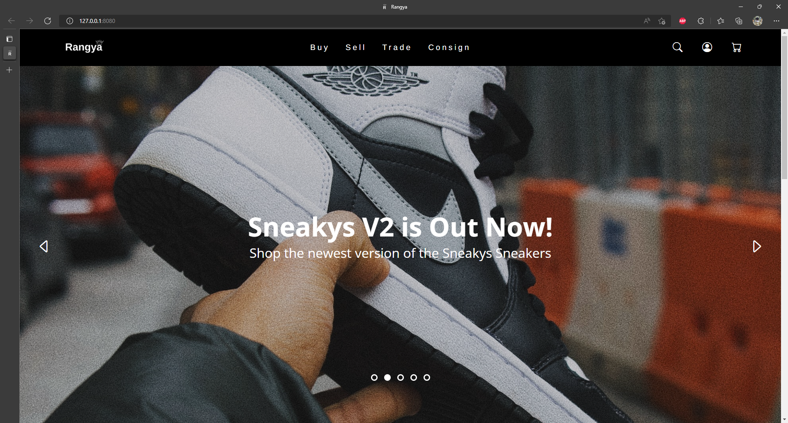

<h1>Rangya Web Application</h1>

This is a prototype web application created in partial fulfillment of our Grade 12 Entrepreneurship requirements for the Asia Pacific College, Philippines.
 
<h2>Group Name: Rangya Development Team</h2>
<strong>Project Lead and UED:</strong> Angelo Laus  
<strong>Lead Developer:</strong> Max Chavez  
<strong>Contributor:</strong> Airo Ravinera  
<strong>Contributor:</strong> Hanz Apo  

<h2>Project Screenshots</h2>
You can view the actual project at: http://rangya.shop  

<h3>Landing Page</h3>

